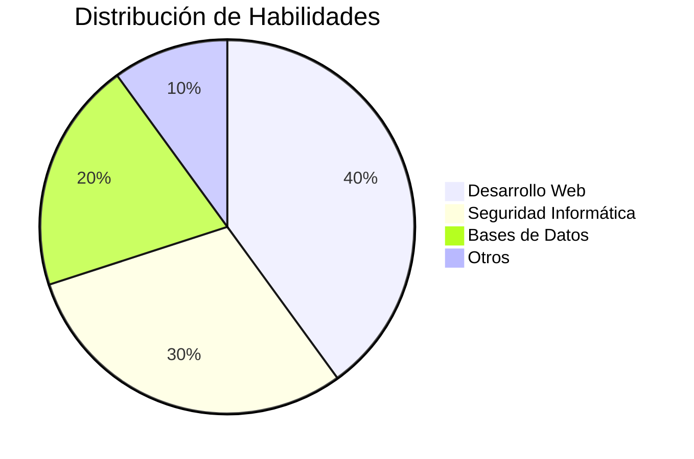
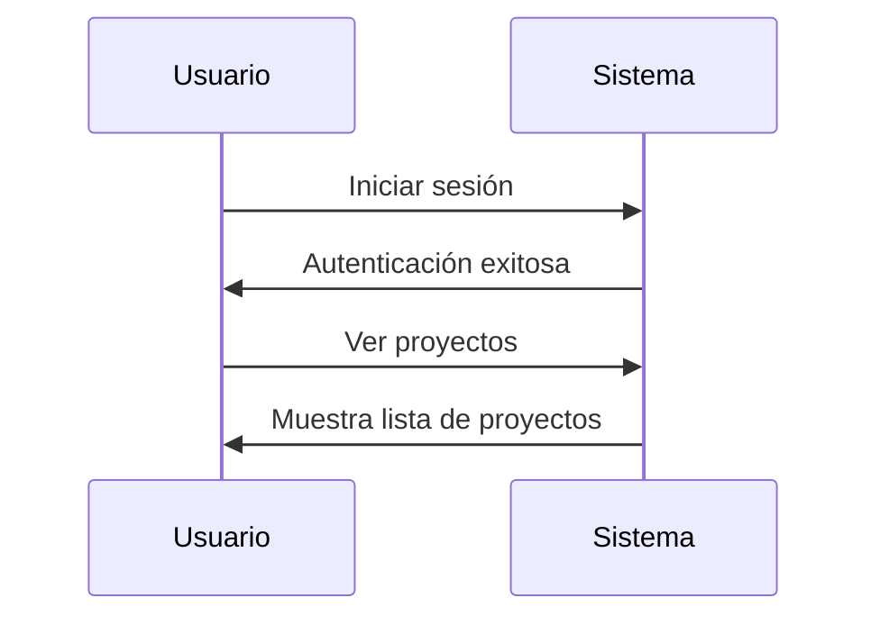
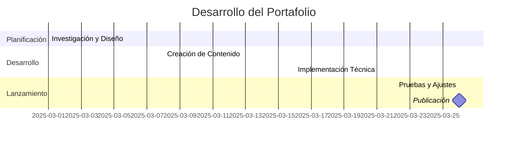

# 💻 **Portafolio Personal - Edwin Miranda**

## 📌 **Sobre Mí**
¡Hola! Soy estudiante de **Ingeniería de Sistemas e Informática** en la **Universidad Continental**. Me apasiona la tecnología, la seguridad informática y el desarrollo web. 🚀

---
## 📂 **Menú**
📍 [Sobre Mí](#-sobre-mí)  
📍 [Proyectos](#-proyectos)  
📍 [Gráficos](#-gráficos)  
📍 [Tablas](#-tablas)  
📍 [Diseños](#-diseños)  
📍 [Contacto](#-contacto)  

---

## 🔥 **Proyectos**
- 🚀 **Sistema de Inventarios en GitHub**  
  📌 Implementación de un sistema de gestión de inventarios con **Node.js** y **MongoDB**.
- 🔐 **Análisis de Seguridad en Aplicaciones Web**  
  📌 Uso de herramientas como **Burp Suite** y **OWASP ZAP**.

---

## 📊 **Gráficos**

---

## 📋 **Tablas**
| 💻 Habilidad | 📈 Nivel |
|-------------|---------|
| HTML & CSS  | ⭐⭐⭐⭐ |
| JavaScript  | ⭐⭐⭐ |
| Python      | ⭐⭐⭐⭐ |
| SQL        | ⭐⭐⭐ |

---

## 🎨 **Diseños y Cómic**

---

## 📩 **Contacto**
📧 Email: [tuemail@example.com](mailto:tuemail@example.com)  
🐙 GitHub: [github.com/tuusuario](https://github.com/tuusuario)  
💼 LinkedIn: [linkedin.com/in/tuusuario](https://linkedin.com/in/tuusuario)  
